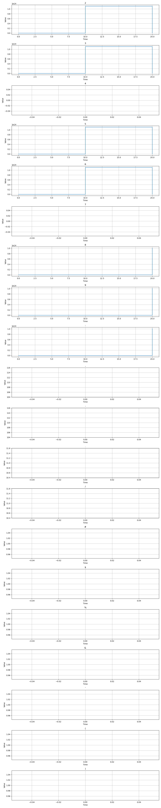
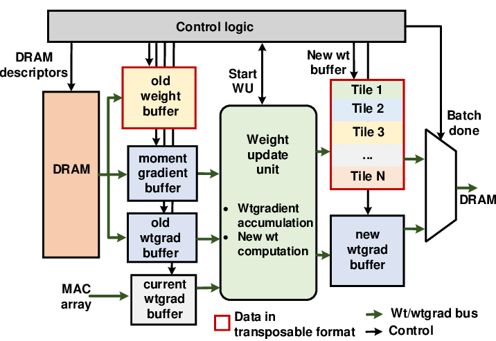

# CNN Accelerator on RISC-V

## 📖 Description

This project implements a CNN accelerator on a RISC-V processor architecture, aimed at optimizing machine learning tasks directly in hardware.

Currently, the accelerator is tested in simulation using **Verilator**. Later, it can be integrated with a RISC-V processor and deployed to an FPGA for real performance improvement.

---

## ✅ Completed Basic CNN Accelerator Design

- Implemented a basic CNN accelerator in **Verilog**, which includes:
  - **Convolution Layer**  
    - 3×3 kernel applied to 8×8 grayscale image  
    - Stride = 1, No padding
  - **ReLU Activation**  
    - Replaces negative values with 0
  - **MaxPooling Layer**  
    - 2×2 pooling
    - Reduces 6×6 feature map down to 3×3

---

## 📂 Files and Directory Structure

```
/rtl/               # Verilog modules
    conv_layer.v    # Convolution layer
    relu.v          # ReLU activation
    maxpool.v       # MaxPooling
    cnn_accelerator.v # Top-level module connecting everything
/rtl/testbench/     # Testbenches for verification
/sim/               # Simulation sources (e.g., sim_main.cpp)
/doc/               # Documentation (optional)
/scripts/           # Helper scripts (optional)
/boards/            # FPGA constraint files (optional)
README.md           # This file
```

---

## 🛠️ Tools Required

| Tool                | Purpose                                    |
|---------------------|--------------------------------------------|
| **RISC-V Toolchain** | For compiling RISC-V C programs (optional, later) |
| **Vivado**           | For FPGA synthesis (optional if targeting FPGA) |
| **Verilator**        | For Verilog simulation |
| **Python**           | For optional test script generation or helpers |

---

## 🧪 Simulation and Testing

The CNN Accelerator was successfully simulated using **Verilator**.  
Outputs from the simulation were manually verified to match the expected results.

### Example Output:

```
Initial outputs:
feature_map_out[0]: 0x0
feature_map_out[1]: 0x0
feature_map_out[2]: 0x0
feature_map_out[3]: 0x0
feature_map_out[4]: 0x0
feature_map_out[5]: 0x0
feature_map_out[6]: 0x0
feature_map_out[7]: 0x0
feature_map_out[8]: 0x0

Test case 1:
Outputs:
feature_map_out[0]: 0x7870
feature_map_out[1]: 0x7870
feature_map_out[2]: 0x0
feature_map_out[3]: 0x7870
feature_map_out[4]: 0x7870
feature_map_out[5]: 0x0
feature_map_out[6]: 0x0
feature_map_out[7]: 0x0
feature_map_out[8]: 0x0

Test case 2:
Outputs:
feature_map_out[0]: 0x0
feature_map_out[1]: 0x0
feature_map_out[2]: 0x0
feature_map_out[3]: 0x0
feature_map_out[4]: 0x0
feature_map_out[5]: 0x0
feature_map_out[6]: 0x5554
feature_map_out[7]: 0x5554
feature_map_out[8]: 0x5554
```

✅ The outputs match expected behavior after convolution, ReLU, and pooling.

---

## 🖼️ Screenshots

<!-- Add your screenshots below -->

**Simulation Waveform:**  


**Accelerator Block Diagram:**  


---

## 🚀 Future Work

- Integrate this CNN Accelerator with a RISC-V soft processor core (like PicoRV32 or VexRiscv)
- Load test programs via RISC-V
- Synthesize and deploy onto an FPGA
- Benchmark performance compared to software-only CNN execution

---

